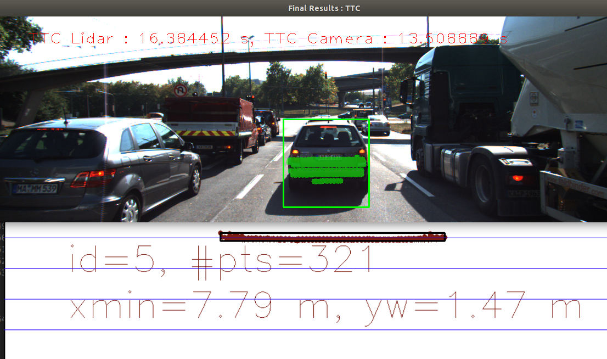
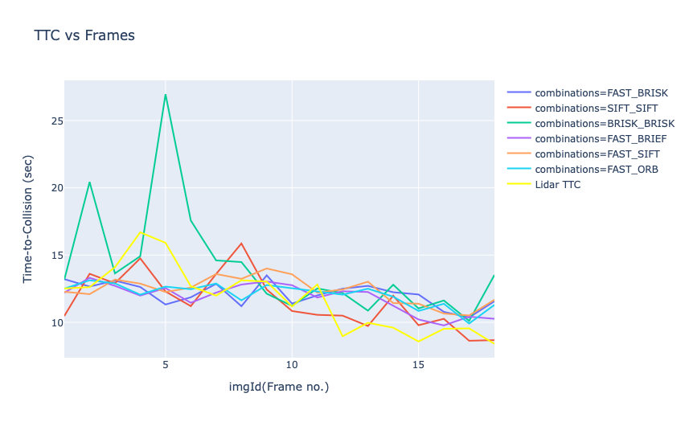

# SFND 3D Object Tracking

Welcome to the final project of the camera course. By completing all the lessons, you now have a solid understanding of keypoint detectors, descriptors, and methods to match them between successive images. Also, you know how to detect objects in an image using the YOLO deep-learning framework. And finally, you know how to associate regions in a camera image with Lidar points in 3D space. Let's take a look at our program schematic to see what we already have accomplished and what's still missing.


In this final project, you will implement the missing parts in the schematic. To do this, you will complete four major tasks:
1. First, you will develop a way to match 3D objects over time by using keypoint correspondences.
2. Second, you will compute the TTC based on Lidar measurements.
3. You will then proceed to do the same using the camera, which requires to first associate keypoint matches to regions of interest and then to compute the TTC based on those matches.
4. And lastly, you will conduct various tests with the framework. Your goal is to identify the most suitable detector/descriptor combination for TTC estimation and also to search for problems that can lead to faulty measurements by the camera or Lidar sensor. In the last course of this Nanodegree, you will learn about the Kalman filter, which is a great way to combine the two independent TTC measurements into an improved version which is much more reliable than a single sensor alone can be. But before we think about such things, let us focus on your final project in the camera course.

## Assignment Report


### Rubrics
#### FP.1 Match 3D Objects

 <span style="color:blue">
"Implement the method "matchBoundingBoxes", which takes as input both the previous and the current data frames and provides as output the ids of the matched regions of interest (i.e. the boxID property). Matches must be the ones with the highest number of keypoint correspondences."
</span>

```cpp
void matchBoundingBoxes(std::vector<cv::DMatch> &matches, std::map<int, int> &bbBestMatches, DataFrame &prevFrame, DataFrame &currFrame)
{
    size_t p_size = prevFrame.boundingBoxes.size();
    size_t c_size = currFrame.boundingBoxes.size();

    cv::Mat cnt_mat = cv::Mat::zeros(p_size, c_size, CV_32S);

    for(const auto &match : matches){
     	cv::KeyPoint& prevKpt = prevFrame.keypoints[match.queryIdx];
      cv::KeyPoint& currKpt = currFrame.keypoints[match.trainIdx];

      for(const BoundingBox& bbox1 : prevFrame.boundingBoxes){
        for(const BoundingBox& bbox2 : currFrame.boundingBoxes){
         if(bbox1.roi.contains(prevKpt.pt) && bbox2.roi.contains(currKpt.pt)){
          	cnt_mat.at<int>(bbox1.boxID, bbox2.boxID)++;
         }
        }
      }
    }
    //finding the max correspondences
    for(int i=0; i < cnt_mat.rows; i++){
      int bestMatchInd = -1;
      int bestMatchSum = 0;
     	for(int j =0; j < cnt_mat.cols; j++){
        if(cnt_mat.at<int>(i, j) > 0 &&  cnt_mat.at<int>(i, j) > bestMatchSum){
         	bestMatchSum = cnt_mat.at<int>(i, j);
          bestMatchInd = j;
        }
      }

      if(bestMatchInd != -1){
       	bbBestMatches.emplace(i, bestMatchInd);
      }
    }
}
```

#### FP.2 Compute Lidar-based TTC

 <span style="color:blue">
"Compute the time-to-collision in second for all matched 3D objects using only Lidar measurements from the matched bounding boxes between current and previous frame."
</span>

```cpp
void computeTTCLidar(std::vector<LidarPoint> &lidarPointsPrev,
                     std::vector<LidarPoint> &lidarPointsCurr, double frameRate, double &TTC)
{
    // find closest distance to Lidar points within ego lane
    double minXPrev = lidarPointsPrev[0].x, minXCurr = lidarPointsPrev[0].x;
    //x is point above the ego vehicle /  i.e driving direction

    for(const auto lidarPtprev : lidarPointsPrev)
        minXPrev += lidarPtprev.x;

    for(const auto lidarPtcurr : lidarPointsCurr)
        minXCurr += lidarPtcurr.x;

    minXPrev /= lidarPointsPrev.size();
    minXCurr /= lidarPointsCurr.size();

    double sampleTime_s = 1.0 / frameRate;
    TTC = minXCurr * sampleTime_s / (minXPrev - minXCurr);
}
```

#### FP.3 Associate Keypoint Correspondences with Bounding Boxes

 <span style="color:blue">
"Prepare the TTC computation based on camera measurements by associating keypoint correspondences to the bounding boxes which enclose them. All matches which satisfy this condition must be added to a vector in the respective bounding box."
</span>

```cpp
// associate a given bounding box with the keypoints it contains
void clusterKptMatchesWithROI(BoundingBox &boundingBox, std::vector<cv::KeyPoint> &kptsPrev, std::vector<cv::KeyPoint> &kptsCurr, std::vector<cv::DMatch> &kptMatches)
{
    float mean_dst = 0.0;
    float noKpt = 0.0;
    for(auto match : kptMatches){
        cv::KeyPoint kpt = kptsPrev[match.queryIdx];
        if(boundingBox.roi.contains(kpt.pt)){
            mean_dst+=match.distance;
            noKpt++;
        }
    }
    mean_dst/=noKpt;

    for(auto match : kptMatches){
        cv::KeyPoint kptCurr = kptsCurr[match.trainIdx];
        if(boundingBox.roi.contains(kptCurr.pt) && match.distance < mean_dst){
            boundingBox.keypoints.push_back(kptCurr);
            boundingBox.kptMatches.push_back(match);
        }
    }

}
```

#### FP.4 Compute Camera-based TTC

 <span style="color:blue">
"Compute the time-to-collision in second for all matched 3D objects using only keypoint correspondences from the matched bounding boxes between current and previous frame."
</span>

```cpp
// Compute time-to-collision (TTC) based on keypoint correspondences in successive images
void computeTTCCamera(std::vector<cv::KeyPoint> &kptsPrev, std::vector<cv::KeyPoint> &kptsCurr,
                      std::vector<cv::DMatch> kptMatches, double frameRate, double &TTC, cv::Mat *visImg)
{
      // compute distance ratios between all matched keypoints
     vector<double> distRatios; // stores the distance ratios for all keypoints between curr. and prev. frame
     for (auto it1 = kptMatches.begin(); it1 != kptMatches.end() - 1; ++it1)
     { // outer kpt. loop

         // get current keypoint and its matched partner in the prev. frame
         cv::KeyPoint kpOuterCurr = kptsCurr.at(it1->trainIdx);
         cv::KeyPoint kpOuterPrev = kptsPrev.at(it1->queryIdx);

         for (auto it2 = kptMatches.begin() + 1; it2 != kptMatches.end(); ++it2)
         { // inner kpt.-loop

             double minDist = 100.0; // min. required distance

             // get next keypoint and its matched partner in the prev. frame
             cv::KeyPoint kpInnerCurr = kptsCurr.at(it2->trainIdx);
             cv::KeyPoint kpInnerPrev = kptsPrev.at(it2->queryIdx);

             // compute distances and distance ratios
             double distCurr = cv::norm(kpOuterCurr.pt - kpInnerCurr.pt);
             double distPrev = cv::norm(kpOuterPrev.pt - kpInnerPrev.pt);

             if (distPrev > std::numeric_limits<double>::epsilon() && distCurr >= minDist)
             {
                 // avoid division by zero
                 double distRatio = distCurr / distPrev;
                 distRatios.push_back(distRatio);
             }
         }
     }

     // only continue if list of distance ratios is not empty
     if (distRatios.size() == 0)
     {
         TTC = NAN;
         return;
     }

     std::sort(distRatios.begin(), distRatios.end());
     const bool isEven = (distRatios.size() % 2 == 0) ? true : false;
     const int medianIndex = floor((distRatios.size() / 2));

     double medianDistRatio;
     if (isEven)
     {
         medianDistRatio = distRatios[medianIndex-1] + distRatios[medianIndex];
         medianDistRatio /= 2.0;
     }
     else
     {
         medianDistRatio = distRatios[medianIndex];
     }

     double dT = 1 / frameRate;
     TTC = -dT / (1 - medianDistRatio);
}
```

#### FP.5 & 6 Performance Evaluation

 <span style="color:blue">

When the detected Lidar points are distributed on wide on x-direction, the method of averaging the detected points will cause the TTC to jump as in the situation captured below.



The reason is twofold. One, It could be because of the Lidar high resolution which makes it able to capture the curved edges of the vehicle which we are not interested in for this application. And two, As the mean x-direction was used to compute of TTC, measurements are prone to outliers. Calculated mean shifted far away than the actual closest point which will estimate more time for collision as the preceding vehicle get more far away.
We could mitigate this by incorporating the uncertainty and the motion model has not been incorporated into the system such as the Kalman Filter to reduce such errorneuos result from the noisy measurements.

Tables below summarizes the performance of several combinations of different detectors and descriptors. Several evaluation metrics are employed as presented in the columns of the table. To evaluate the performance of Camera and Lidar TTC, the mean abs difference between both (Camera and lidar) has been used.
 With this methods, we can incur at which max/min difference between the TTC calculated from lidar and camera occured and know which combination of detector and descriptor performs the worst and best respectively. With iterating through all combinations, FAST/BRIEF and SIFT/SIFT have shown the least difference and FAST/FREAK and FAST/ORB have the largest residual in TTC computation. Overall, the winners are **FAST/BRIEF** and **SIFT/SIFT**.

|Detector| Descriptor | Prev Image Frame  | Current Image Frame | Lidar TTC | Camera TTC | Difference in TTC | Lidar TTC Average | Camera TTC Average |
|--------|------------|------------------|---------------------|-----------|------------|-------------------|-------------------|-------------------|
|SHITOMASI |BRISK|12|13|9.42504|13.3278|3.90278|11.7444|12.1111|
|FAST|BRIEF|17|18|8.53557|12.1254|3.58979|11.7444|12.1451|
|FAST|ORB|11|12|9.88711|15.1852|5.29804|11.7444|12.5039|
|AKAZE|AKAZE|2|3|16.3845|12.6936|3.69089|11.7444|12.2384|
|SIFT|SIFT|2|3|16.3845|13.0962|3.28828|11.7444|11.6279|
|FAST|FREAK|4|5|12.7299|5.98282|6.74713|11.7444|11.8134|

<span style="color:blue"/>

During computing the Camera-TTC, the mean for all keypoints was used. It is possible for two successive frames that previous mean is equal to current mean, and this will have a erroneuous result i.e TTC=NAN. Moreover, Camera-TTC is not reliable enough. When the preceding car is more and more close to the ego car, the Object Detection model gives a big wrong result like the below image and may cause an ID switch to this new bounding box which is a quite common occurance in Computer Vision.


When the bounding boxes overlaps a lot with each other, the function matchBoundingBoxes becomes invalid. I have tried my best , but have not found a valid way. Both TTC-computed methods are not enough when considering the Z dimensions which means the road is not flat. The algorithm computing TTC based on Lidar and camera is derived from Plane Trigonometry. If the road is not flat. the algorithm is invalid. 

### Analysis Frame by Frame

For brevity, the top rankings detector/descriptor combinations of from my Mid-term Project (FAST+SIFT, FAST/BRIEF, FAST/ORB, BRISK/BRISK, FAST+BRISK) were used for analysis frame by frame TTC for Camera and Lidar. From the successive frames, as we are moving towards and closer the preceding vehicle, the TTC monotonically decreases in time. Below are the plots of TTC (sec) against the frame no. based on the measurements on the csv files at ```results/*.csv```. Source code on plots is at ```plots.ipynb```



From above plot, we can see that there is a trend of the TTC decreasing as we travese through the remaining frames in the sequence (which imploes that we are moving closer to the preceding vehicle). Moreover, it can be seen that from the plots, with the BRISK/BRISK combination, the TTC fluates greatly at frame 5, that surges from 15s to 25s which defies the law of physics. As we are approaching close to the proceding vehicle, TTC must decrease in time. Based on this findings, BRISK/BRISK are likely to detect more noisy keypoints and shifted the mean euclidean distance, and contributes to the erroneous results and thus not suitable for this type of application.  

Overall, all of the TTC computations are noisy and has fluactuation here and there, which can be smooth by using fusing this two sensors input onto the aforementioned Kalman Filter for state estimation to get a better estimate of the measurements. In comparison to all the TTC (Lidar and Camera) frame-by-frame, 
FAST_BRIEF combinations (purple line) does come close to the measurement of the Lidar (yellow line) and hence the winner goes to *** FAST_BRIEF ***.

## Dependencies for Running Locally
* cmake >= 2.8
  * All OSes: [click here for installation instructions](https://cmake.org/install/)
* make >= 4.1 (Linux, Mac), 3.81 (Windows)
  * Linux: make is installed by default on most Linux distros
  * Mac: [install Xcode command line tools to get make](https://developer.apple.com/xcode/features/)
  * Windows: [Click here for installation instructions](http://gnuwin32.sourceforge.net/packages/make.htm)
* Git LFS
  * Weight files are handled using [LFS](https://git-lfs.github.com/)
* OpenCV >= 4.1
  * This must be compiled from source using the `-D OPENCV_ENABLE_NONFREE=ON` cmake flag for testing the SIFT and SURF detectors.
  * The OpenCV 4.1.0 source code can be found [here](https://github.com/opencv/opencv/tree/4.1.0)
* gcc/g++ >= 5.4
  * Linux: gcc / g++ is installed by default on most Linux distros
  * Mac: same deal as make - [install Xcode command line tools](https://developer.apple.com/xcode/features/)
  * Windows: recommend using [MinGW](http://www.mingw.org/)

## Basic Build Instructions

1. Clone this repo.
2. Make a build directory in the top level project directory: `mkdir build && cd build`
3. Compile: `cmake .. && make`
4. Run it: `./3D_object_tracking`.
